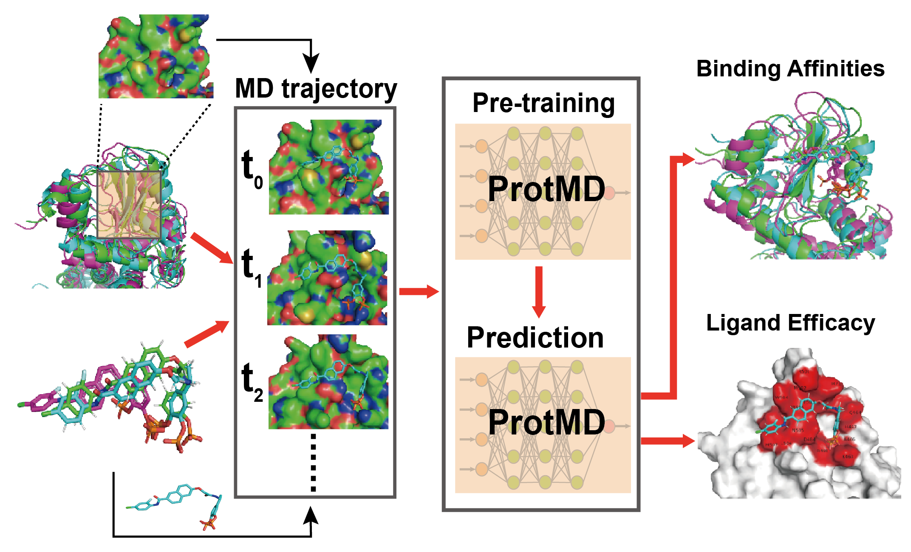

# 🐾🐾🐾Pre-training Protein Geometric Models via Molecular Dynamics Trajectories
🎇NEWS!!!🎇     
**Our paper has been recently accepted by Advanced Science (impact factor = 17.5).
Please see the published version [here](https://doi.org/10.1002/advs.202203796) or the arXiv version [there](https://arxiv.org/abs/2204.08663).**

This is the official code for **ProtMD**, a novel pre-training method based on the trajectories of 
protein-ligand pairs generated by molecular dynamics (MD) simulations. ProtMD can be divided into two stages:
first is to pre-train the molecule encoder, and then transfer it to the downstream tasks with fine-tuning
or linear-probing. This research is highly supported by [MindrankAI](https://www.mindrank.ai/), a pioneering AI-based drug discovery company 
located in Hangzhou, China.  

<p align="center"></p>

## Dependencies
Below is the basic running environment.
```markdown
python==3.9.10  
torch==1.10.2+cu113  
```

Start by setting up a virtual environment. 
```markdown
conda create -n md python=3.9
conda install pytorch torchvision torchaudio cudatoolkit=11.3 -c pytorch
pip install einops
source activate md 

# for visualization
pip install pandas matplotlib seaborn scipy 
pip install -U scikit-learn
```

## Data
### MD Trajectory Generation and Processing
We use the MD data as the pretraining data source. Unfortunately, the MD data is currently not publicly available
since the data provider MindrankAI does not agree to make it open. However, we offer a very detailed description on how
to produce the MD trajectories independently. The following programs or packages are convenient ways to process the MD trajectories.    

**[1] GROMACS**:  First download the zipped [file](https://manual.gromacs.org/documentation/2021.5/download.html) and then 
install GROMACS following [this instruction](https://manual.gromacs.org/documentation/5.1/install-guide/index.html).

**[2] MDanalysis**: [MDanalysis](https://www.mdanalysis.org/) is highly recommended. You can master it quickly by 
reading this [tutorial](https://docs.mdanalysis.org/stable/documentation_pages/overview.html).
```markdown
conda install -c conda-forge mdanalysis`  
conda install -c conda-forge MDAnalysisTests` (for sample data) 
```
**[3] mdtraj**: [mdtraj](https://www.mdtraj.org/1.9.8.dev0/index.html) is another convenient package to process MD trajectories.
```markdown
conda install -c conda-forge mdtraj
```

**[4] VMD**: [VMD](https://www.ks.uiuc.edu/Research/vmd/) can be leveraged to visualize the MD trajectories easily. 
First you need to register and download VMD. Then load the MD trajectories (`.xtc` file) into VMD along with its conformation (`.gro`).
At last, you have to save the trajectories (`.pdb` file) all at once.
   
### The Binding Affinity Prediciton Task 
We use the well-curated dataset provided by [Atom3d](https://github.com/drorlab/atom3d) [[1]](#1).
First you have to install atom3D by `pip install atom3d`. Next, just download 
`split-by-sequence-identity-30` and `split-by-sequence-identity-60` datasets from `https://www.atom3d.ai/`.
Later, preprocess the data by running:
```
python pdbbind/dataloader_pdb.py
```

**Attention!**
The 60% identity split is changed in Atom3d [[1]](#1) official data source. The latest sizes of training and test
sizes are 3563 and 452. However, as we followed the results of HoloProt [[2]](#2), which used th original splits of atom3d with 60% 
identity. It is necessary to find the previous-version splits, which is available in HoloProt's github: 
https://github.com/vsomnath/holoprot . The training, validaition and test have 3678, 460 and 460 samples, respectively. 
Then just use the index in `identity60_split.json` file to split the PDBbind dataset. 

**Updated!**
The author of HoloProt [[2]](#2) told me that *'Indeed there were some pdb files missing - some of them were just corrupted
 and surface associated binaries could not be used on them, so they were left out. But I did notice that the test set had
  only a couple of files missing and decided to train the models on a limited training set.'* Therefore, it means the dataset
used by HoloProt has some problems.


### The Ligand Efficacy Prediction Task
For ligand efficacy prediction task, we also utilize the dataset offered by ATOM3D [[1]](#1). 
You have to download the corresponding data from https://zenodo.org/record/4914734. 

### EQUIBIND
To verify the generalization capability of ProtMD, we test it on the predicted structures that is docked by EquiBind [[3]](#3).
The Equibind preprocessed dataset is [here](https://zenodo.org/record/6034088#.Yk0ehHpBxPY). 


   
## Benchmark on PDBbind
There are several implementations and reproductions of diverse methods for the binding affinity prediction task and the ligand efficacy task.
We mainly refer to three papers published in top AI conferences, containing ATOM3D [[1]](#1), HoloProt [[2]](#2), and MXMNet [[4]](#4).

## Pre-train & Fine-tune
### Pre-train Stage
We use four GPUs to pretrain the geometric neural networks.
```markdown
python pretrain.py --gpu=0,1,2,3
```


### Fine-tune/Linear-probing Stage
After the pretraining, it is time to use the pretrained model weight as the initialization for a wide variety of specific problems. 
Run the following script to test the effectiveness of ProtMD in downstream tasks. You ought to set `pretrain` as the path to get access to
the saved model parameters. You can also choose the argument `data` from [`lba`, `lep`] to 
select different tasks, including ligand binding affinity prediction (`lba`) and ligand efficacy prediction (`lep`). 
You can also add the argument `linear_probe` to only tune the final output layer. 
```markdown
python main.py --data=lba --split=30 --linear_probe --pretrain=model.pt --gpu=0,1,2,3
```

## Data Parallel in Pytorch
Here we provide some interesting content that may be helpful for people who are new to GPU parallel, 
which is necessary for a fast and efficient pretraining on especially a large protein dataset. 
This [tutorial](https://ailab120.synology.me/pdf/Multi-GPU%20Training%20on%20single%20node.pdf) provides a comprehensive overview of 
multi-GPU training on a single node with mainstream deep learning frameworks, such as Pytorch, Tensorflow and Keras.   

### Data Parallel with nn.DistributedDataParallel
```python
# a Chinese introduction to distributed training：https://zhuanlan.zhihu.com/p/86441879
torch.distributed.init_process_group(backend='nccl', init_method='tcp://localhost:23456', rank=0, world_size=1)

# note the difference between nn.DistributedDataParallel and nn.DataParallel
https://discuss.pytorch.org/t/dataparallel-vs-distributeddataparallel/77891/4

# some outputs fail to participate in the backpropagation：https://github.com/pytorch/pytorch/issues/43259#
model = DistributedDataParallel(model, device_ids=[int(x) for x in args.gpu.split(',')], find_unused_parameters=True)

```

### Apex 
Apex is a more flexible framework for mixed precision and distributed training in Pytorch. 
The github website is [here](https://github.com/NVIDIA/apex). 
The main API for parallel training is [here](https://nvidia.github.io/apex/parallel.html).
A simple example for training ResNet with Apex is [here](https://github.com/NVIDIA/DALI/blob/main/docs/examples/use_cases/pytorch/resnet50/main.py).  

### Multi-GPU Stuck Problem
Someone may encounter a problem, where the pytorch works well with 4 GPUs but is stuck with 2-GPU parallel.  
Some blogs reporing the similar issue:
https://discuss.pytorch.org/t/distrubuteddataparallel-and-dataparallel-hangs-in-specified-model/74322.   

This person resolve the problem by adopting AMP, but it does not work for me.   
https://discuss.pytorch.org/t/dataparallel-and-distributeddataparallel-stuck-at-100-gpu-usage/125490/6.   

Someone recommends using DistributedDataParalle, but it still fails for me.   
https://discuss.pytorch.org/t/nn-dataparallel-gets-stuck/125427/7.    

A potential solution: https://github.com/pytorch/pytorch/issues/1637#issuecomment-338268158.  

## Contact and Cite
If you are interested in our work and recognize our contributions, please cite it!   
Also, please do not hesitate to [email me]((mailto:fw2359@columbia.edu)) (*fw2359@columbia.edu*) immediately if you have any sort of questions or 
fancy points that deserve further communication. 
```markdown
article{wu2022pre,
  title={Pre-Training of Equivariant Graph Matching Networks with Conformation Flexibility for Drug Binding},
  author={Wu, Fang and Jin, Shuting and Jiang, Yinghui and Jin, Xurui and Tang, Bowen and Niu, Zhangming and Liu, Xiangrong and Zhang, Qiang and Zeng, Xiangxiang and Li, Stan Z},
  journal={Advanced Science},
  volume={9},
  number={33},
  pages={2203796},
  year={2022},
  publisher={Wiley Online Library}
}
```
## References
<a id="1">[1]</a> 
Townshend, Raphael JL, et al. "Atom3d: Tasks on molecules in three dimensions." arXiv preprint arXiv:2012.04035 (2020).  
<a id="2">[2]</a> 
Somnath, Vignesh Ram, Charlotte Bunne, and Andreas Krause. "Multi-scale representation learning on proteins." Advances in Neural Information Processing Systems 34 (2021): 25244-25255.    
<a id="3">[3]</a> 
Stärk, Hannes, et al. "Equibind: Geometric deep learning for drug binding structure prediction." International Conference on Machine Learning. PMLR, 2022.  
<a id="4">[4]</a> 
Zhang, Shuo, Yang Liu, and Lei Xie. "Molecular mechanics-driven graph neural network with multiplex graph for molecular structures." arXiv preprint arXiv:2011.07457 (2020).  

